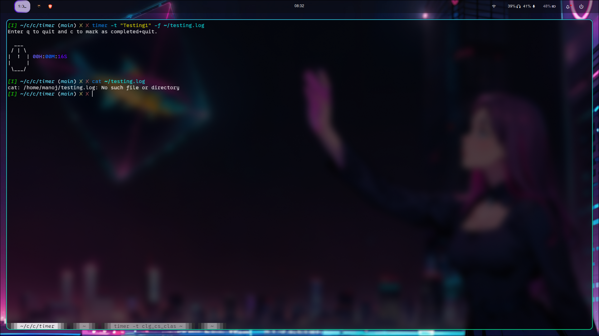

# ⏱️ Tick-Tock Timer: Your Simple CLI Stopwatch

---

Tired of clunky GUI timers or setting alarms that are just too rigid? Meet **Tick-Tock Timer**! 🎉 This little gem is a minimalist, super-efficient command-line timer built in C. It's perfect for tracking your work sprints, coffee breaks, or just seeing how long that compilation really takes! 🚀

⚠️ Important Note: This application is designed for Unix-like systems (Linux, macOS). It also works seamlessly within Windows Subsystem for Linux (WSL). However, due to its reliance on POSIX APIs for interactive terminal control, it will not work on native Windows environments (e.g., Command Prompt or PowerShell directly) without significant modifications.

## ✨ What Makes it Awesome?

- **Blazingly Fast:** Written in pure C, it's incredibly lightweight and performant. ⚡
- **Super Simple:** No complex commands, just `timer` and you're off! 🏃‍♂️
- **Real-time Display:** Watch the seconds tick by right in your terminal. ⏳
- **Instant Control:** Press `q` or `Q` to quit the instantly or press `c` to mark as complete and Quit. 🛑
- **Log Your Tasks:** Add a title to your task and create logs in give file 📦

## 🎬 Quick Demo

See it in action – it's as easy as pie! 🥧


## 🛠️ Installation

Getting Tick-Tock Timer up and running is a breeze! Just follow these steps:

1. **Clone the Repository:**
   Let's grab a copy of the project. We only need the latest version, so `--depth 1` is perfect! ⬇️

   ```bash
   git clone --depth 1 https://github.com/ManojPanda3/timer.git
   ```

2. **Navigate into the Directory:**
   Time to jump into the project folder. 📁

   ```bash
   cd timer
   ```

3. **Build the Executable:**
   This project uses a `Makefile` for super easy compilation. `gcc` will work its magic! ✨

   ```bash
   make
   ```

4. **Install to Your Local Binaries:**
   To make `timer` accessible from anywhere in your terminal, copy it to a directory included in your `PATH`. We highly recommend `~/.local/bin/` as a standard location for user-specific executables! 💡

   ```bash
   sudo cp ./build/timer ~/.local/bin/
   ```

   _You might need `sudo` depending on your user permissions, but `~/.local/bin/` should typically be writable without it._

5. **Ensure `~/.local/bin` is in Your PATH (if it's not already):**
   This crucial step ensures your shell knows where to find the `timer` command. Add the following line to your shell's configuration file (e.g., `~/.bashrc` for Bash or `~/.zshrc` for Zsh):

   ```bash
   export PATH=\"$HOME/.local/bin:$PATH\"
   ```

   Then, apply the changes by sourcing your shell configuration file:

   ```bash
   source ~/.bashrc  # Or source ~/.zshrc if you use Zsh
   ```

   _You only need to do this once! Your terminal will remember it for future sessions!_ 🔄

## 🚀 How to Use

Once installed, using Tick-Tock Timer is as simple as it gets!

Just type `timer` in your terminal and hit Enter for no titled task:

```bash
timer
```

`timer` with title

```bash
timer -t "My Task1"
```

`timer` with log file

```bash
timer -t "My Task1" -f "~/myproject.log"
```

The timer will start counting from `00:00:00`. To stop it and see the final duration, just press `Ctrl+C`. 🛑

## 🤝 Contributing

Got an idea to make Tick-Tock Timer even better? Found a bug? We'd love to see your contributions! Here's how you can help make this project shine brighter: ✨

1. **Fork** the repository on GitHub.
2. **Clone** your forked repository to your local machine.
3. **Create a new branch** for your feature or bugfix:

   ```bash
   git checkout -b feature/your-awesome-feature
   ```

   (Replace `your-awesome-feature` with something descriptive!)

4. **Make your changes** and commit them with a clear, concise message:

   ```bash
   git commit -m 'feat: Add a concise description of your changes' # Or 'fix:', 'chore:', etc.
   ```

5. **Push your branch** to your forked repository:

   ```bash
   git push origin feature/your-awesome-feature
   ```

6. **Open a Pull Request** to the `main` branch of this repository.

_Your contributions make the open-source world a better place! Thank you for considering!_ ❤️

## 📄 License

This project is open-source and distributed under the [MIT License](LICENSE). Feel free to use, modify, and distribute it as you see fit! 💖

---
